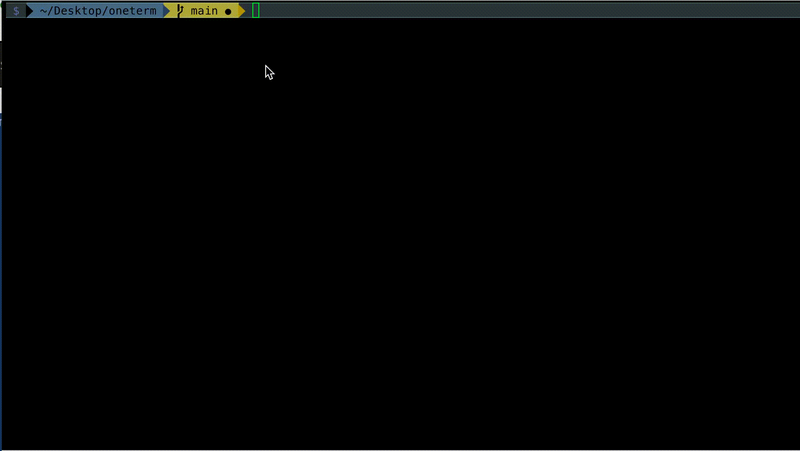
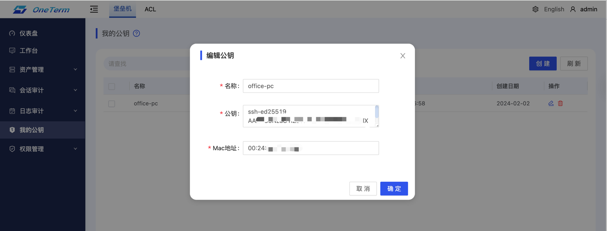
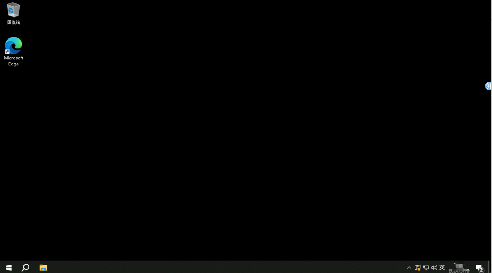

<h3 align="center">OneTerm</h3>
<p align="center">
  <a href="https://github.com/veops/oneterm/blob/main/LICENSE"></a>
  <a href="">=1.18"></a>
  <a href="https:https://github.com/sendya/ant-design-pro-vue"></a>
</p>

**`OneTerm`** Bastion Host, based on the 4A concept, i.e., Authentication, Authorization, Account, and Audit, is designed and developed.

`Main use`: It is mainly used for products that enhance IT internal control and compliance security by implementing control and audit of IT personnel's operating behaviors in enterprises.

`Main functions`: role management, authorization approval, resource access control, session audit, etc.

---
[English](README.md) / [中文](README_cn.md)
- Product document：https://veops.cn/docs/
- Preview online: <a href="https://term.veops.cn/oneterm/workstation" target="_blank">OneTerm</a>
   - username: **`demo`**   or   **`admin`**
   - password: 123456

> **ATTENTION**: branch `main` may be unstable as the result of continued development, please pull code from [release](https://github.com/veops/oneterm/releases) or deploy via docker image

## 🚀Install

### docker-compose

```bash
git clone https://github.com/veops/oneterm.git
cd oneterm/deploy
docker-compose up -d
```

## ✅ Validation

- View: [http://127.0.0.1:8666](http://127.0.0.1:8666)
- username: admin
- password: 123456


## SSH
### View

### Login
```shell
ssh -p12229 admin@127.0.0.1 # Note that the port, user, and address need to be replaced with your current environment
```
### Passwordless Login Configuration
> Terminal passwordless login is designed for enhanced security and convenience.
1. Generate and retrieve the public key, get the MAC address
```shell
ssh-keygen -t ed25519 # Generate the key following the prompts
cat /root/.ssh/id_ed25519.pub # Copy the public key. The public key address is obtained from the generation process as shown in the previous step
ifconfig | grep -B1 "xxx.xxx.xxx.xxx" | awk '/ether/{print $2}' # Get the MAC address, replace xxx.xxx.xxx.xxx with your local IP
```


2. Place the public key and MAC on the platform
   

### More Streamlined Login Method
```shell
ssh oneterm
```
> To achieve this effect, you can configure as follows:
1. Create the ssh config file
```shell
touch ~/.ssh/config
```
2. Add the following content to **`~/.ssh/config`**
```shell
Host oneterm
    HostName 127.0.0.1 # Replace with the address of your oneterm's ssh server
    Port 12229 # Replace with the port of your oneterm's ssh server
    User admin # Replace with your platform user on oneterm
```

## VNC/RDP


## 🎯TODO
- [ ] The asset list is associated with the CMDB authorization service tree.
- [ ] The web terminal page supports multiple sessions with tabs, etc.

## 📚Docs

doc link：https://veops.cn/docs/docs/oneterm/onterm_design

## 🔗Releated Projects

[go-ansiterm](https://github.com/veops/go-ansiterm)：Linux terminal emulator

## 🤝Community

**Welcome to follow our WeChat official account and join our group channels**

<p align="center">
  
</p>